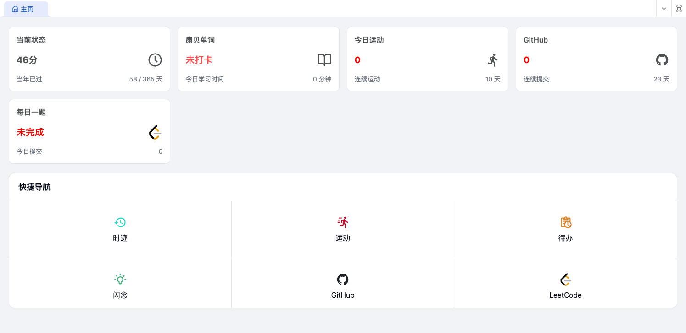
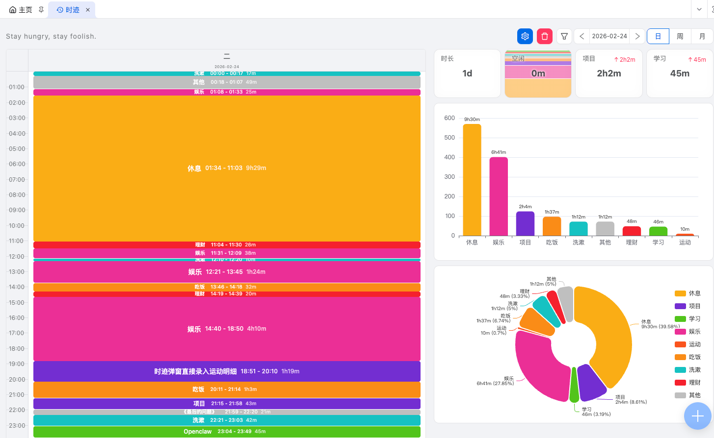
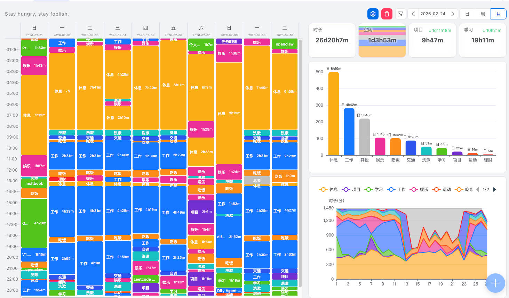
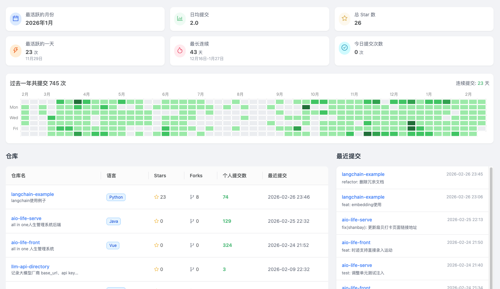
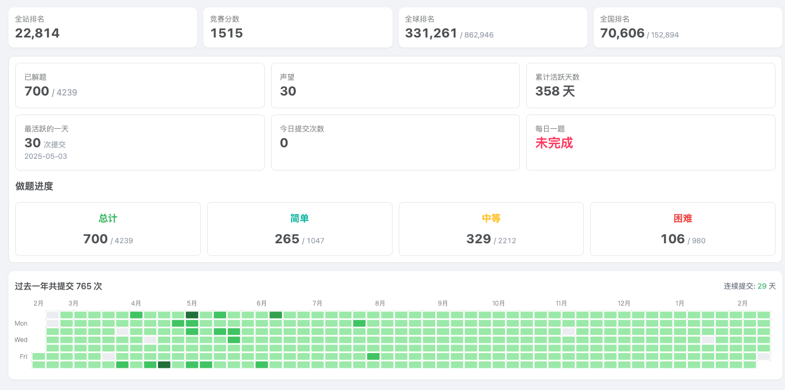
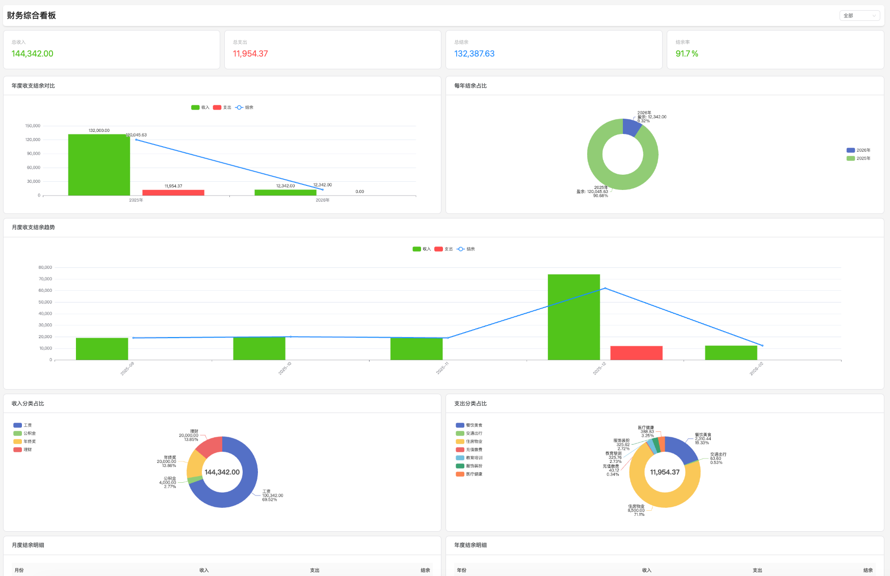
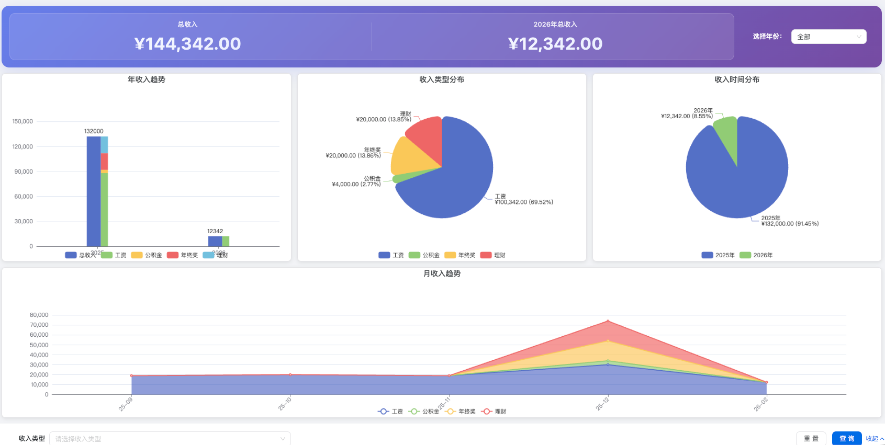
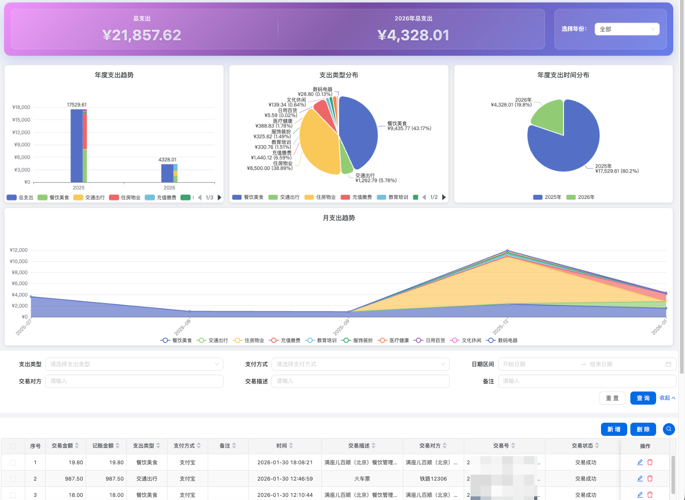

# AIO Life

> 记录、统计、分析人生的所有数据
>
> **AIO Life** 是一款 All-in-One 人生管理系统，致力于全方位记录、统计与分析人生的所有数据。通过主动录入与第三方数据拉取，实现人生痕迹的全面数字化，助您洞察数据，掌控生活节奏。

> [!NOTE]
> 本项目为开源项目，使用者必须在网站标注作者名称以及指向本项目的链接。如果不想保留署名，必须首先获得授权。不得用于非法用途，请勿商用和二次售卖。

> [!NOTE]
> 在线体验地址：https://aiolife.top  (配置管理的数据隔离权限还没有弄好，所以页面没有放出来)
>
> 前端地址：https://github.com/lys1313013/aio-life-front
>
> 后端地址：https://github.com/lys1313013/aio-life-serve

# 项目背景

个人比较喜欢看各种数据统计，希望能够通过一个系统量化自己的人生数据。也希望通过数据的支撑，更好地驱动和掌控自己的生活节奏。


# 效果

- 用上了这个系统之后，因为在首页设置了四个每日卡片，除了一些意外的情况，基本上每天都可以完成卡片上的事项（比如坚持运动，Leetcode 每日打卡，Github持续提交等）。

- 因为会记录每一分钟时间的花费，也会尽可能的避免浪费时间和频繁切换任务（切换任务会导致多次记录，因为懒得多次记录，就尽可能一次性完成任务）。


# 功能

### 首页

- **当前状态**：数据来自于时迹
- **今日运动**：查询本地数据库获取当日运动状态
- **github**: 调用 github接口查询提交记录
- **leetcode**: 查询每日一题是否完成，点击可跳转到对应题目
- **扇贝单词**：调用扇贝单词的接口获取当天是否打卡

### 任务中心
- **待办**：记录一些待办的事项

### 记录
- **时迹**: 记录每一分钟的时间花费。使用技巧：在事项完成后，立刻进行记录。
- **运动**：日常运动记录
- **视频观看**: 通过浏览器插件实现在 B站观看视频时自动同步指定的视频观看进度
- **闪念**: 随时记录灵感与想法
- **笔记**: 随便记点啥
- **里程碑**：记录生活关键节点

### 财务中心
- **概览**：收入和支出看板，查看结余与结余比
- **收入**：记录每一笔收入
- **支出**：记录每一笔支出
- **账单导入**：支持支付宝和微信账单导入，手机支付宝导出账单可自动匹配分类

### 物品中心
- **设备墙**：记录电子设备等
- 【❌】**衣柜**：记录衣服、裤子和鞋子等

### 编程看板
- **GitHub 看板**: GitHub 数据统计
- **Leetcode 看板**：Leetcode数据统计

### 配置管理 （权限还未处理好，目前只能管理员查看与修改）
- **字典类型**: 维护字典类型
- **字典数据**: 维护字典数据 

### 系统管理
- **用户管理**：查看用户信息

## AI接入

- 【❌】AI点评个人数据，自然语言录入数据，接入 Langchain4j


## 截图展示
### 首页



### 时迹




### 设备墙


### Github 



### leetcode



### 视频观看


### 财务概览



### 收入



### 支出




## 技术栈

- **Frontend**: [Vue 3](https://vuejs.org/), [Vite](https://vitejs.dev/), [TypeScript](https://www.typescriptlang.org/)
- **UI Framework**: [Ant Design Vue](https://antdv.com/), [Tailwind CSS](https://tailwindcss.com/)
- **Charts**: [ECharts](https://echarts.apache.org/)

## 快速开始

### 环境准备

- Node.js >= 20.10.0
- pnpm >= 9.12.0

### 安装依赖

```bash
# 启用 corepack (如果尚未启用)
corepack enable

# 安装依赖
pnpm install
```

### 启动项目

```bash
# 启动应用
pnpm run dev
```

### 构建项目

```bash
# 构建应用
pnpm run build
```

## 开源与贡献

欢迎参与贡献

### 贡献流程

1. **Fork 仓库** ➜ 点击 GitHub 右上角 `Fork` 按钮。
2. **创建分支** ➜ 推荐使用有意义的分支名，如 `feature/data-scraper-optimization`。
3. **提交代码** ➜ 确保代码可读性高，符合规范。
4. **提交 Pull Request（PR）** ➜ 详细描述您的更改内容，并关联相关 issue（如有）。
5. **等待审核** ➜ 维护者会进行代码审核并合并。
